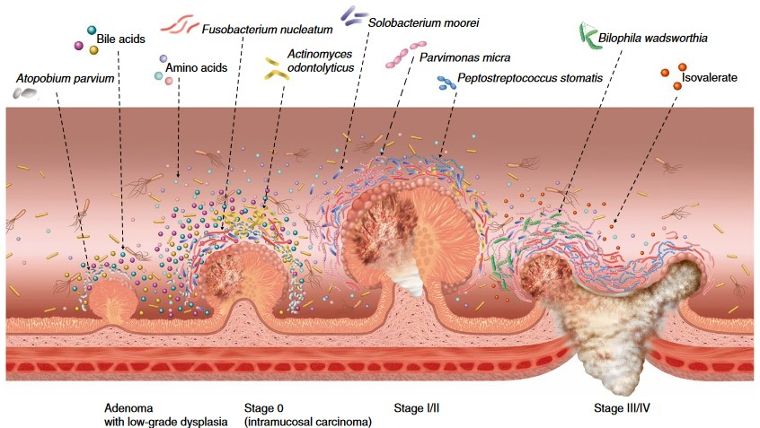
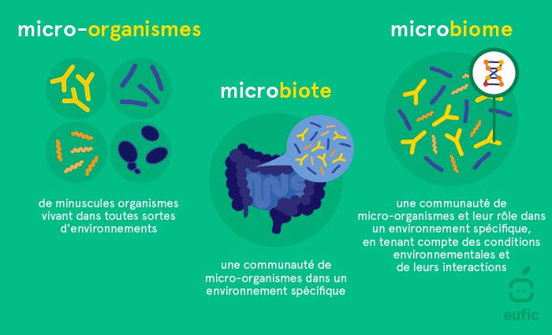

### JEDHA_Certification_Microbiota

# CRC_Diag
 


Création d'une application web de diagnostic du cancer colorectal à partir des données fournit sur la composition du microbiote intestinal.

Ici vous trouverez un [article de l'Inserm](https://www.inserm.fr/dossier/microbiote-intestinal-flore-intestinale/#a-chacun-son-microbiote) concernant l'intérêt d'étudier le microbiote.
Dans ce nouvel [article de l'Inserm](https://www.inserm.fr/actualite/cibler-microbiote-intestinal-pour-lutter-contre-cancer-colon/), vous trouverez le point de départ de notre réflexion et de notre envie de créer une application de diagnostic.

 

## Prérequis

- Docker desktop

## Installation

```
$ git clone copier le git clone git hub
$ cd path/vers/le/dossier/appli
$ sh run.sh
```

## Fabriqué avec

- [Gitlab](https://gitlab.com/)
- [Streamlit](https://www.streamlit.io/)
- [Docker](https://www.docker.com/)

## Conclusion

